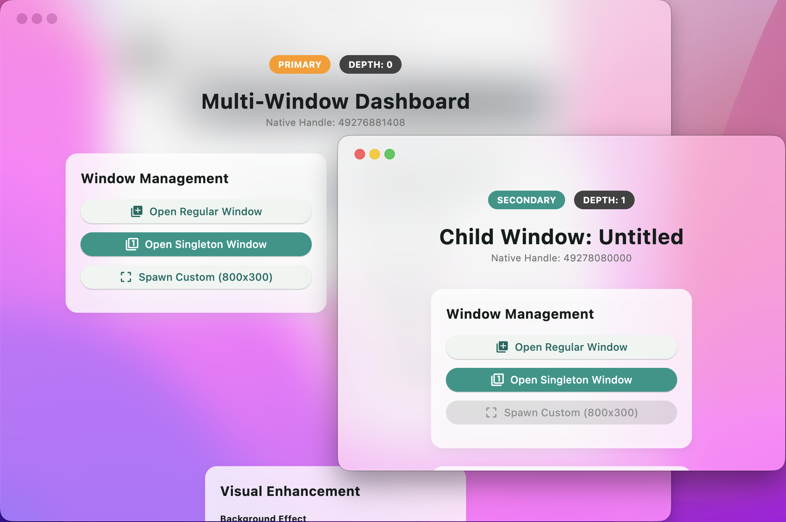

# bitsdojo_window

This project is based on the following MIT-licensed project:

- bitsdojo_window
  Copyright (c) 2020-2021 Bogdan Hobeanu
  License: MIT

A [Flutter package](https://pub.dev/packages/bitsdojo_window) that makes it easy to customize and work with your Flutter desktop app window on **Windows**, **macOS** and **Linux**.


# bitsdojo_window_plus

**bitsdojo_window_plus** is an enhanced version of the original package, designed for better multi-window management, more robust platform integration, and improved stability for complex desktop applications.


- Multi-window support
- backgroundEffect
- alwaysOnTop
- onClose handler
- setWindowTitleBarButtonVisibility
- titlebar height
- and so on...

Platform notes:
- Multi-window support: Windows, macOS, Linux
- `backgroundEffect`: Windows, macOS
- `alwaysOnTop`: Windows, macOS, Linux
- `onClose`: Windows, macOS, Linux
- `setWindowTitleBarButtonVisibility`: macOS, Linux
- `titleBarHeight`: Windows, macOS




Watch the tutorial to get started. Click the image below to watch the video:

[](https://www.youtube.com/watch?v=bee2AHQpGK4 "Click to open")


**Features**:

- Custom window frame - remove standard Windows/macOS/Linux titlebar and buttons
- Hide window on startup
- Show/hide window
- Move window using Flutter widget
- Minimize/Maximize/Restore/Close window
- Set window size, minimum size and maximum size
- Set window position
- Set window alignment on screen (center/topLeft/topRight/bottomLeft/bottomRight)
- Set window title

# Getting Started

Add the package to your project's `pubspec.yaml` file. Since this is a federated plugin, you should add both the core package and the platform-specific package for macOS:

```yaml
# pubspec.yaml

dependencies:
  flutter:
    sdk: flutter
  bitsdojo_window:
    git:
      url: https://github.com/Twilight-Evd/bitsdojo_window_plus.git
      path: bitsdojo_window
      ref: v0.0.1
```

Flutter-side setup can now be kept fairly small:

```dart
void main() {
  runBitsdojoWindowApp(
    app: const MyApp(),
    routes: {
      'child': (context, arguments) => const ChildScreen(),
    },
    onWindowReady: (window) {
      if (window.isMainWindow) {
        window.size = const Size(900, 700);
        window.alignment = Alignment.center;
      }
      window.titleBarHeight = 50;
      window.show();
    },
  );
}

class MyApp extends StatelessWidget {
  const MyApp({super.key});

  @override
  Widget build(BuildContext context) {
    return MaterialApp(
      home: RoutedWindowHost(
        defaultChild: const MainScreen(),
        onCloseRequested: (context, window) async {
          if (!window.isMainWindow) return true;
          return await showDialog<bool>(
                context: context,
                builder: (_) => const ExitDialog(),
              ) ??
              false;
        },
      ),
    );
  }
}
```

# For Windows apps

Inside your application folder, go to `windows\runner\main.cpp` and wire the runner like this:

```diff
// windows/runner/main.cpp

  ...

  #include "flutter_window.h"
  #include "utils.h"

+ #include <bitsdojo_window_windows/bitsdojo_window_plugin.h>
+ #include <bitsdojo_window_windows/multi_window_manager.h>
+
+ auto bdw = bitsdojo_window_configure(BDW_CUSTOM_FRAME | BDW_HIDE_ON_STARTUP);

  int APIENTRY wWinMain(_In_ HINSTANCE instance, _In_opt_ HINSTANCE prev,
+                       _In_ wchar_t *command_line, _In_ int show_command) {
...
+   MultiWindowManager::GetInstance().SetWindowFactory(
+       [](const wchar_t *title, int x, int y, int width, int height,
+          const char *name, const char *arguments) -> HWND {
+         flutter::DartProject project(L"data");
+         auto window = new FlutterWindow(project);
+         Win32Window::Point origin(x, y);
+         Win32Window::Size size(width, height);
+
+         if (window->Create(title, origin, size)) {
+           return window->GetHandle();
+         }
+
+         delete window;
+         return nullptr;
+       });
+
+   FlutterWindow window(project);
...
```

And in `windows\runner\flutter_window.cpp`:

```diff
// windows/runner/flutter_window.cpp

+ #include <bitsdojo_window_windows/multi_window_manager.h>

  void FlutterWindow::OnDestroy() {
+   MultiWindowManager::GetInstance().OnWindowDestroyed(GetHandle());
    if (flutter_controller_) {
      flutter_controller_ = nullptr;
    }

    Win32Window::OnDestroy();
  }
```

This is the minimum native glue needed for custom frames plus plugin-managed secondary windows on Windows.

# For macOS apps

Inside your application folder, go to `macos\runner\AppDelegate.swift` and use the plugin base delegate:

```diff
// macos/runner/AppDelegate.swift

  import Cocoa
+ import bitsdojo_window_macos

  @main
+ class AppDelegate: BitsdojoWindowAppDelegate {}
```

`BitsdojoWindowAppDelegate` already handles the primary-window close flow for multi-window apps, so you no longer need to hand-roll that lifecycle glue in each project.

Then update `macos\runner\MainFlutterWindow.swift` to use `BitsdojoWindow` as the runner window:

```diff
// macos/runner/MainFlutterWindow.swift

  import Cocoa
  import FlutterMacOS
+ import bitsdojo_window_macos

- class MainFlutterWindow: NSWindow {
+ class MainFlutterWindow: BitsdojoWindow {
+   override func bitsdojo_window_configure() -> UInt {
+     return BDW_CUSTOM_FRAME | BDW_HIDE_ON_STARTUP
+   }
+
+   override func bitsdojo_window_title_bar_height() -> Double {
+     return 50.0
+   }
+
+   override func setupFlutter() {
+     super.setupFlutter()
+     if let flutterViewController = self.contentViewController as? FlutterViewController {
+       RegisterGeneratedPlugins(registry: flutterViewController)
+     }
+   }
  }
```

That is the minimum macOS runner setup for custom frames, plugin-managed close handling, and multi-window support. Override `bitsdojo_window_title_bar_height()` only if you want a custom title bar height.

#

If you don't want to use a custom frame and prefer the standard window titlebar and buttons, you can remove the `BDW_CUSTOM_FRAME` flag from the code above.

If you don't want to hide the window on startup, you can remove the `BDW_HIDE_ON_STARTUP` flag from the code above.

# For Linux apps

Inside your application folder, go to `linux\my_application.cc` and let the plugin restore child-window state from the environment:

```diff
// linux/my_application.cc

  ...
+ #include <stdio.h>
+ #include <unistd.h>
  #include "flutter/generated_plugin_registrant.h"
+ #include <bitsdojo_window_linux/bitsdojo_window_plugin.h>

  struct _MyApplication {
+   GtkApplication parent_instance;
+   char **dart_entrypoint_arguments;

  ...

  }

+  auto bdw = bitsdojo_window_from(window);
+  bdw->setCustomFrame(true);
+  bitsdojo_window_set_dart_entrypoint_arguments(self->dart_entrypoint_arguments);
+  bitsdojo_window_configure_from_environment(window);

   g_autoptr(FlDartProject) project = fl_dart_project_new();
+
+  if (self->dart_entrypoint_arguments) {
+    fl_dart_project_set_dart_entrypoint_arguments(
+        project, self->dart_entrypoint_arguments);
+  }
+
+  FlView *view = fl_view_new(project);
+  GdkRGBA background_color;
+  gdk_rgba_parse(&background_color, "#F6FBFA");
+  fl_view_set_background_color(view, &background_color);
+
+ extern "C" gboolean my_application_local_command_line(
+     GApplication *application,
+     gchar ***arguments,
+     int *exit_status) {
+   MyApplication *self = MY_APPLICATION(application);
+
+   if (self->dart_entrypoint_arguments) {
+     g_strfreev(self->dart_entrypoint_arguments);
+   }
+   self->dart_entrypoint_arguments = g_strdupv(*arguments + 1);
+
+   g_autoptr(GError) error = nullptr;
+   if (!g_application_register(application, nullptr, &error)) {
+     g_warning("Failed to register: %s", error->message);
+     *exit_status = 1;
+     return TRUE;
+   }
+
+   return FALSE;
+ }
```

For the best Linux startup behavior:
- Keep the window hidden until Flutter emits the `first-frame` signal, then call `gtk_widget_show(...)` and `gtk_window_present(...)`.
- Only call `gtk_window_present(...)` immediately from `command_line` when you are targeting an already-existing window. Let a brand-new child window wait for its first frame.
- Give `FlView` a light fallback background instead of pure black if your Flutter UI uses transparent scaffolds or custom frames.

That keeps Linux multi-window support inside the plugin flow, so you do not need custom runner-side spawn logic.

# Flutter app integration

For new integrations, the shortest Flutter-side setup is:

```dart
// lib/main.dart

import 'package:bitsdojo_window/bitsdojo_window.dart';
import 'package:flutter/material.dart';

void main() {
  runBitsdojoWindowApp(
    app: const MyApp(),
    routes: {
      'child_window': (context, arguments) =>
          MyChildWidget(arguments: arguments),
    },
    onWindowReady: (window) {
      const initialSize = Size(600, 450);
      window.minSize = initialSize;
      window.size = initialSize;
      window.alignment = Alignment.center;
      window.show();
    },
  );
}

class MyApp extends StatelessWidget {
  const MyApp({super.key});

  @override
  Widget build(BuildContext context) {
    return MaterialApp(
      home: RoutedWindowHost(
        defaultChild: const MyHomePage(),
      ),
    );
  }
}
```

This keeps the common setup in one place:
- `runBitsdojoWindowApp(...)` handles binding initialization, route registration, window-ready setup, and `runApp(...)`.
- `RoutedWindowHost(...)` handles route resolution plus window event wiring.

If you prefer lower-level control, `setupBitsdojoWindow(...)`, `WindowRouter`, `doWhenWindowReady(...)`, and `appWindow.onClose` are still available.

For animated resize/reposition flows, prefer semantic alignment when possible:

```dart
await appWindow.animateTo(
  size: const Size(900, 700),
  alignment: Alignment.center,
  duration: const Duration(milliseconds: 280),
);
```

You can find examples in the [example](./bitsdojo_window/example) folder.

Here is an example that displays this window:

<details>
<summary>Click to expand</summary>

```dart
import 'package:flutter/material.dart';
import 'package:bitsdojo_window/bitsdojo_window.dart';

void main() {
  runApp(const MyApp());
  doWhenWindowReady(() {
    final win = appWindow;
    const initialSize = Size(600, 450);
    win.minSize = initialSize;
    win.size = initialSize;
    win.alignment = Alignment.center;
    win.title = "Custom window with Flutter";
    win.show();
  });
}

const borderColor = Color(0xFF805306);

class MyApp extends StatelessWidget {
  const MyApp({Key? key}) : super(key: key);

  @override
  Widget build(BuildContext context) {
    return MaterialApp(
      debugShowCheckedModeBanner: false,
      home: Scaffold(
        body: WindowBorder(
          color: borderColor,
          width: 1,
          child: Row(
            children: const [LeftSide(), RightSide()],
          ),
        ),
      ),
    );
  }
}

const sidebarColor = Color(0xFFF6A00C);

class LeftSide extends StatelessWidget {
  const LeftSide({Key? key}) : super(key: key);
  @override
  Widget build(BuildContext context) {
    return SizedBox(
        width: 200,
        child: Container(
            color: sidebarColor,
            child: Column(
              children: [
                WindowTitleBarBox(child: MoveWindow()),
                Expanded(child: Container())
              ],
            )));
  }
}

const backgroundStartColor = Color(0xFFFFD500);
const backgroundEndColor = Color(0xFFF6A00C);

class RightSide extends StatelessWidget {
  const RightSide({Key? key}) : super(key: key);
  @override
  Widget build(BuildContext context) {
    return Expanded(
      child: Container(
        decoration: const BoxDecoration(
          gradient: LinearGradient(
              begin: Alignment.topCenter,
              end: Alignment.bottomCenter,
              colors: [backgroundStartColor, backgroundEndColor],
              stops: [0.0, 1.0]),
        ),
        child: Column(children: [
          WindowTitleBarBox(
            child: Row(
              children: [Expanded(child: MoveWindow()), const WindowButtons()],
            ),
          )
        ]),
      ),
    );
  }
}

final buttonColors = WindowButtonColors(
    iconNormal: const Color(0xFF805306),
    mouseOver: const Color(0xFFF6A00C),
    mouseDown: const Color(0xFF805306),
    iconMouseOver: const Color(0xFF805306),
    iconMouseDown: const Color(0xFFFFD500));

final closeButtonColors = WindowButtonColors(
    mouseOver: const Color(0xFFD32F2F),
    mouseDown: const Color(0xFFB71C1C),
    iconNormal: const Color(0xFF805306),
    iconMouseOver: Colors.white);

class WindowButtons extends StatelessWidget {
  const WindowButtons({Key? key}) : super(key: key);
  @override
  Widget build(BuildContext context) {
    return Row(
      children: [
        MinimizeWindowButton(colors: buttonColors),
        MaximizeWindowButton(colors: buttonColors),
        CloseWindowButton(colors: closeButtonColors),
      ],
    );
  }
}
```

</details>

#

# **Want to help? Become a sponsor**

I am developing this package in my spare time and any help is appreciated.

If you want to help you can [become a sponsor](https://github.com/sponsors/bitsdojo).

🙏 Thank you!

## ☕️ Current sponsors:

No sponsors
